# Домашнее задание к занятию "`Основы Terraform. Yandex Cloud`" - `Дедюрин Денис`

---
## Задание 1.

В качестве ответа всегда полностью прикладывайте ваш terraform-код в git.
Убедитесь что ваша версия **Terraform** ~>1.8.4

1. Изучите проект. В файле variables.tf объявлены переменные для Yandex provider.
2. Создайте сервисный аккаунт и ключ. [service_account_key_file](https://terraform-provider.yandexcloud.net).
4. Сгенерируйте новый или используйте свой текущий ssh-ключ. Запишите его открытую(public) часть в переменную **vms_ssh_public_root_key**.
5. Инициализируйте проект, выполните код. Исправьте намеренно допущенные синтаксические ошибки. Ищите внимательно, посимвольно. Ответьте, в чём заключается их суть.
6. Подключитесь к консоли ВМ через ssh и выполните команду ``` curl ifconfig.me```.
Примечание: К OS ubuntu "out of a box, те из коробки" необходимо подключаться под пользователем ubuntu: ```"ssh ubuntu@vm_ip_address"```. Предварительно убедитесь, что ваш ключ добавлен в ssh-агент: ```eval $(ssh-agent) && ssh-add``` Вы познакомитесь с тем как при создании ВМ создать своего пользователя в блоке metadata в следующей лекции.;
8. Ответьте, как в процессе обучения могут пригодиться параметры ```preemptible = true``` и ```core_fraction=5``` в параметрах ВМ.

В качестве решения приложите:

- скриншот ЛК Yandex Cloud с созданной ВМ, где видно внешний ip-адрес;
- скриншот консоли, curl должен отобразить тот же внешний ip-адрес;
- ответы на вопросы.

### Ответ:

Через интерфес Я.Облака создаем сервисный аккаунт и генерируем для него ключ.

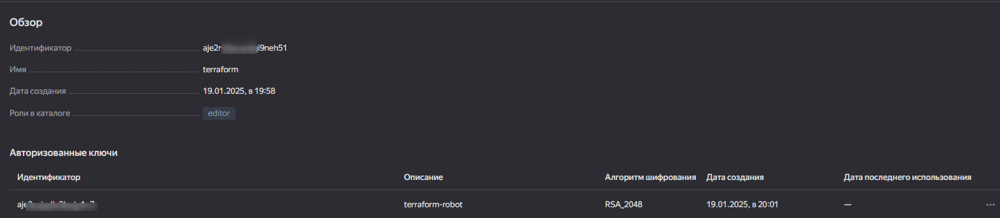

Генерируем ключ ed25519
```
ssh-keygen -t ed25519 -f ~/.ssh/id_ed25519 -q -N ""
```

Прописываем ключ в переменную **vms_ssh_public_root_key** в файле variables.tf

Выполняем команды:

```
terraform init
```


```
terraform plan
```

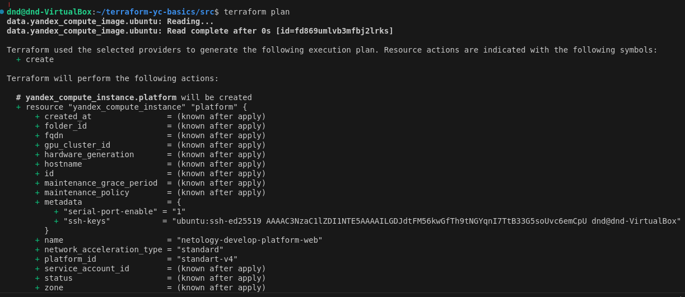
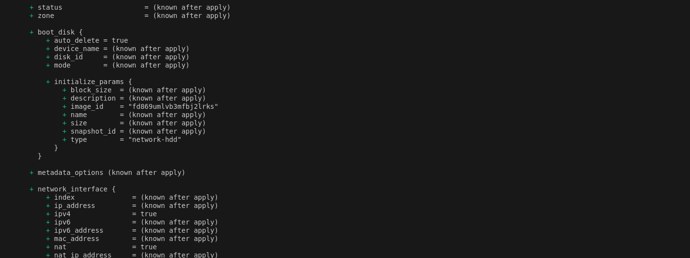
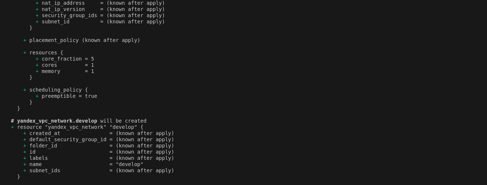
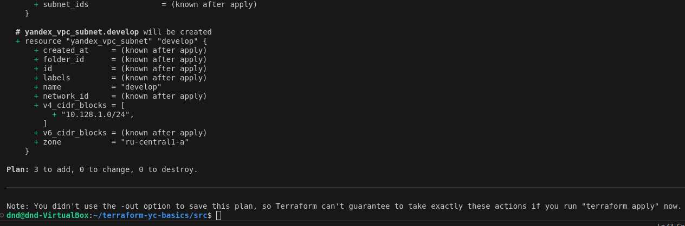

```
terraform apply
```

При выполнении это команды нарываемся на синтаксическую ошибку, в которой говорится, что такой платформы не существует:

```
code = FailedPrecondition desc = Platform "standart-v4" not found
```

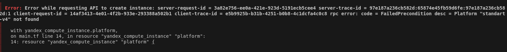

Согласно документации, есть следующие возмодные варианты:

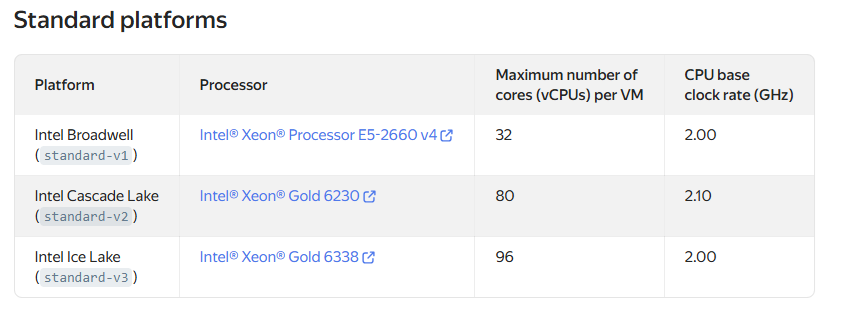

К тому же в коде присутствует еще одна синтаксическая ошибка. В названии самой платформы вместо "**standard**" написано "**standart**".

Испавляем данный параметр на  **standard-v1** и повторно запускаем.

Получаем еще одну ошибку:

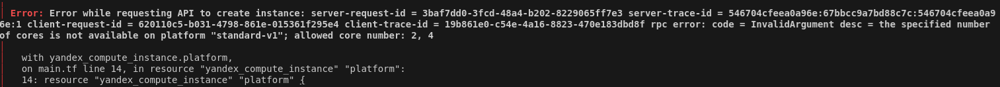

Ошибка указывает, что количество ядер, указанное в конфигурации (**cores = 1**), недоступно для платформы **standard-v1**. Доступные значения для cores на этой платформе — **2** или **4**.

Изменяем конфигурацию и запускаем.

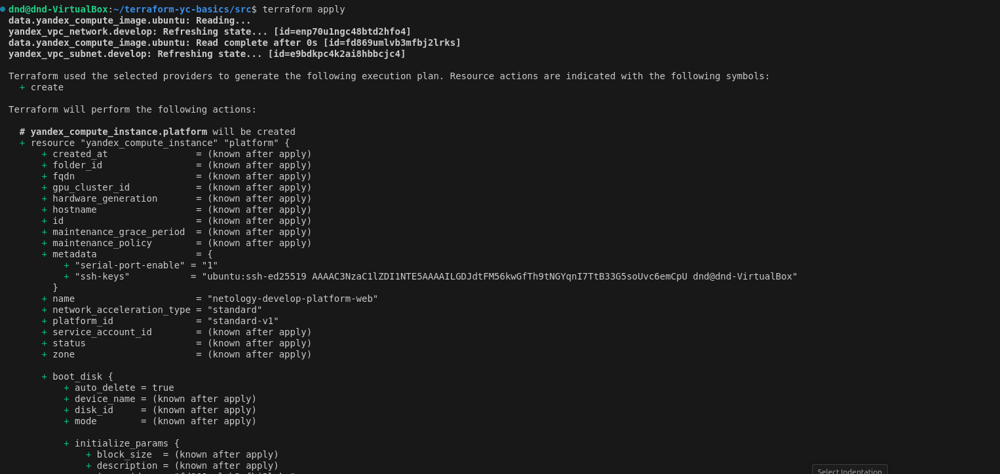
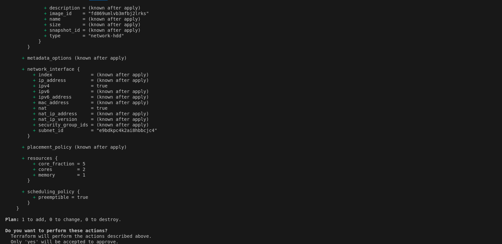
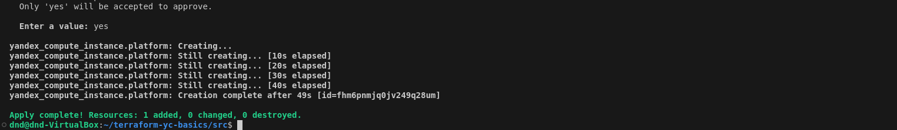

Видим, что команда выполнена успешно.

Переходим на Яндекс облако и так же видим, что ВМ успешно создалась и запустилась и ей присвоился внутренний и внешний IP-адреса.

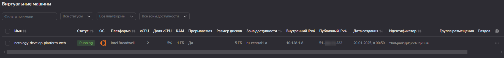
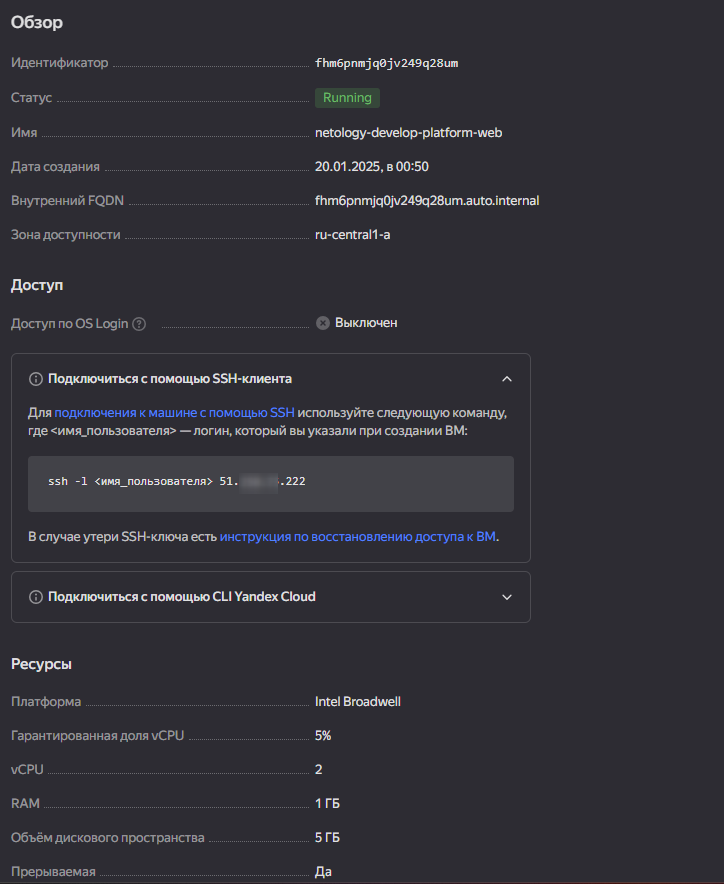

Подключаемся по ssh к созданной ВМ.

```
ssh -l ubuntu 51.XX.XX.222
curl ifconfig.me
```
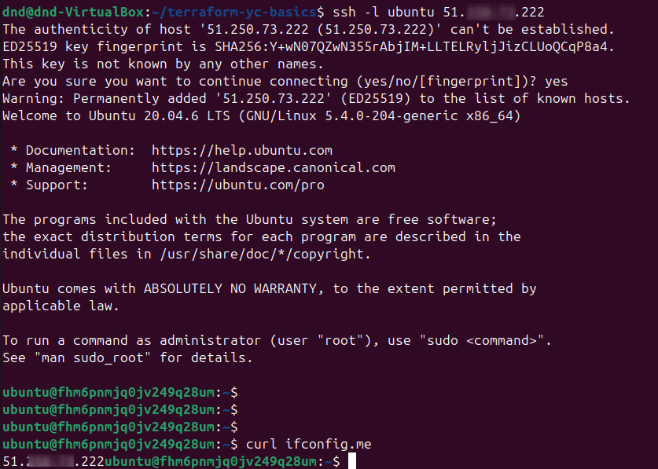

Параметры **preemptible = true** и **core_fraction = 5** предоставляют экономичные и гибкие возможности для тестирования и экспериментов в облаке.

Где:

**preemptible = true** - указывает, что создаваемая ВМ является "прерываемой". Такие машины стоят дешевле и могут быть остановлены Yandex Cloud в течение от 1 до 24 часов. 

**core_fraction = 5** - определяет минимальный гарантированный процент производительности процессора. Например, **core_fraction = 5** означает, что в данном случае гарантируется 5% от вычислительной мощности каждого виртуального ядра.

---
## Задание 2

1. Замените все хардкод-**значения** для ресурсов **yandex_compute_image** и **yandex_compute_instance** на **отдельные** переменные. К названиям переменных ВМ добавьте в начало префикс **vm_web_** .  Пример: **vm_web_name**.
2. Объявите нужные переменные в файле variables.tf, обязательно указывайте тип переменной. Заполните их **default** прежними значениями из main.tf. 
3. Проверьте terraform plan. Изменений быть не должно. 

### Ответ:

Изменяем конфигурационные файлы, убрав хардкод-значения для ресурсов **yandex_compute_image** и **yandex_compute_instance** на **отдельные** переменные.

Конфигурационные файлы теперь выглядат так:

**main.tf**

```
resource "yandex_vpc_network" "develop" {
  name = var.vpc_name
}
resource "yandex_vpc_subnet" "develop" {
  name           = var.vpc_name
  zone           = var.default_zone
  network_id     = yandex_vpc_network.develop.id
  v4_cidr_blocks = var.default_cidr
}

data "yandex_compute_image" "ubuntu" {
  family =  var.vm_web_image_family
}
resource "yandex_compute_instance" "platform" {
  name        = var.vm_web_name
  platform_id = var.vm_web_image_platform
  resources {
    cores         = var.vm_web_cores
    memory        = var.vm_web_memory
    core_fraction = var.vm_web_core_fraction
  }
  boot_disk {
    initialize_params {
      image_id = data.yandex_compute_image.ubuntu.image_id
    }
  }
  scheduling_policy {
    preemptible = var.vm_web_preemptible
  }
  network_interface {
    subnet_id = yandex_vpc_subnet.develop.id
    nat       = true
  }

  metadata = {
    serial-port-enable = 1
    ssh-keys           = "ubuntu:${var.vm_web_vms_ssh_root_key}"
  }

}
```

**variables.tf**
```
###cloud vars

 variable "cloud_id" {
  type        = string
  description = "https://cloud.yandex.ru/docs/resource-manager/operations/cloud/get-id"
  default = "b1glskia0dbos36k28i8"
}

variable "folder_id" {
  type        = string
  description = "https://cloud.yandex.ru/docs/resource-manager/operations/folder/get-id"
  default = "b1g6c8c6gi8ud4pc3deq"
}

variable "default_zone" {
  type        = string
  default     = "ru-central1-a"
  description = "https://cloud.yandex.ru/docs/overview/concepts/geo-scope"
}

variable "default_cidr" {
  type        = list(string)
  default     = ["10.128.1.0/24"]
  description = "https://cloud.yandex.ru/docs/vpc/operations/subnet-create"
}

variable "vpc_name" {
  type        = string
  default     = "develop"
  description = "VPC network & subnet name"
}

variable "vm_web_image_family" {
  type        = string
  default     = "ubuntu-2004-lts"
  description = "Family of the image to use for the VM."
}

variable "vm_web_image_platform" {
  type        = string
  default     = "standard-v1"
  description = "Platform for the VM instance."
}

variable "vm_web_name" {
  type        = string
  default     = "netology-develop-platform-web"
  description = "Name of the VM instance."
}

variable "vm_web_cores" {
  type        = number
  default     = 2
  description = "Number of CPU cores for the VM."
}

variable "vm_web_memory" {
  type        = number
  default     = 4
  description = "Amount of RAM in GB for the VM."
}

variable "vm_web_core_fraction" {
  type        = number
  default     = 5
  description = "Core fraction for the VM instance."
}

variable "vm_web_preemptible" {
  type        = bool
  default     = true
  description = "Whether the VM is preemptible."
}

variable "vm_web_vms_ssh_root_key" {
  type        = string
  default     = "ssh-ed25519 AAAAC3NzaC1lZDI1NTE5AAAAILGDJdtFM56kwGfTh9tNGYqnI7TtB33G5soUvc6emCpU dnd@dnd-VirtualBox"
  description = "ssh-keygen -t ed25519"
}
```

Дополнительно уберем хардкод-значения в файле:

**providers.tf**

```
terraform {
  required_providers {
    yandex = {
      source = "yandex-cloud/yandex"
    }
  }
  required_version = ">=1.5"
}

provider "yandex" {
  # token     = var.token
  cloud_id                 = var.cloud_id
  folder_id                = var.folder_id
  zone                     = var.default_zone
  service_account_key_file = file("~/.authorized_key.json")
}
```

После этого выполняем команду 

```
terraform plan
```

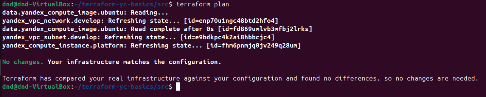

Видим, что после изменений в конфигурациооных файлах, никаих изменений не произошло.

---
## Задание 3

1. Создайте в корне проекта файл 'vms_platform.tf' . Перенесите в него все переменные первой ВМ.
2. Скопируйте блок ресурса и создайте с его помощью вторую ВМ в файле main.tf: **"netology-develop-platform-db"** ,  ```cores  = 2, memory = 2, core_fraction = 20```. Объявите её переменные с префиксом **vm_db_** в том же файле ('vms_platform.tf').  ВМ должна работать в зоне "ru-central1-b"
3. Примените изменения.

### Ответ:


---
## Задание 4

1. Объявите в файле outputs.tf **один** output , содержащий: instance_name, external_ip, fqdn для каждой из ВМ в удобном лично для вас формате.(без хардкода!!!)
2. Примените изменения.

В качестве решения приложите вывод значений ip-адресов команды ```terraform output```.

### Ответ:

---
## Задание 5

1. В файле locals.tf опишите в **одном** local-блоке имя каждой ВМ, используйте интерполяцию ${..} с НЕСКОЛЬКИМИ переменными по примеру из лекции.
2. Замените переменные внутри ресурса ВМ на созданные вами local-переменные.
3. Примените изменения.

### Ответ:

---
## Задание 6

1. Вместо использования трёх переменных  ".._cores",".._memory",".._core_fraction" в блоке  resources {...}, объедините их в единую map-переменную **vms_resources** и  внутри неё конфиги обеих ВМ в виде вложенного map(object).  
   ```
   пример из terraform.tfvars:
   vms_resources = {
     web={
       cores=2
       memory=2
       core_fraction=5
       hdd_size=10
       hdd_type="network-hdd"
       ...
     },
     db= {
       cores=2
       memory=4
       core_fraction=20
       hdd_size=10
       hdd_type="network-ssd"
       ...
     }
   }
   ```
3. Создайте и используйте отдельную map(object) переменную для блока metadata, она должна быть общая для всех ваших ВМ.
   ```
   пример из terraform.tfvars:
   metadata = {
     serial-port-enable = 1
     ssh-keys           = "ubuntu:ssh-ed25519 AAAAC..."
   }
   ```  
  
5. Найдите и закоментируйте все, более не используемые переменные проекта.
6. Проверьте terraform plan. Изменений быть не должно.

### Ответ:

